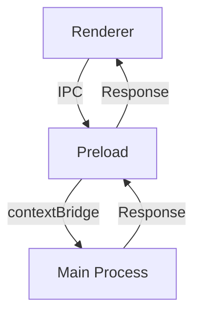

# Documentation Guidelines

You are writing or updating documentation for Loop. Follow these standards for clear, professional technical documentation.

## Documentation Structure

Loop's documentation is organized as follows:

```
docs/
├── README.md                    # Documentation index
├── ARCHITECTURE_DEEP_DIVE.md    # System architecture
├── architecture/                # Architecture guides
│   ├── README.md
│   ├── electron-bootstrap.md
│   ├── ipc-architecture.md
│   ├── ai-systems.md
│   ├── state-management.md
│   └── security.md
├── development/                 # Development guides (if exists)
└── portfolio/                   # Portfolio documents (if exists)
```

## Writing Style

**Professional and Clear**:
- Use clear, concise language
- Write in active voice
- Use present tense for current features
- Avoid jargon unless necessary (and define it)
- Be specific with technical details

**Minimize Emoji Use**:
- Use sparingly and only for clear visual hierarchy
- Acceptable: Section headers (one emoji max)
- Avoid: Decorative emojis in body text
- Never use in code examples or technical specifications

## Document Templates

### Architecture Document Template

```markdown
# [Feature Name] Architecture

Brief overview (1-2 sentences).

## Purpose

What problem does this solve? Why does it exist?

## Design Principles

1. **Principle 1**: Explanation
2. **Principle 2**: Explanation

## Architecture Overview

Describe the high-level architecture. Use diagrams if complex.

## Components

### Component 1

**Responsibility**: What it does
**Location**: `src/path/to/component`
**Dependencies**: What it depends on

### Component 2

...

## Data Flow

Describe how data moves through the system.

## API Reference

Key classes, methods, or interfaces.

## Examples

Practical usage examples.

## Testing

How to test this component.

## Performance Considerations

Performance characteristics and optimization notes.

## Security Considerations

Security implications and best practices.

## Future Improvements

Known limitations and planned enhancements.
```

### Feature Guide Template

```markdown
# [Feature Name] Guide

Brief description of the feature.

## Overview

What is this feature? Who is it for?

## Usage

### Basic Usage

Step-by-step instructions for common use case.

### Advanced Usage

More complex scenarios.

## Configuration

Available configuration options.

## Examples

Real-world examples.

## Troubleshooting

Common issues and solutions.

## API Reference

If applicable, document the API.
```

## Code Examples

**Always use**:
- Syntax highlighting with language identifier
- Complete, runnable examples when possible
- Comments explaining non-obvious parts
- TypeScript type annotations

```typescript
// Good example
import { ProjectService } from '@main/services/ProjectService';

/**
 * Creates a new project with validation
 */
async function createProject(name: string): Promise<Project> {
  // Validate input
  if (!name || name.length === 0) {
    throw new Error('Project name is required');
  }
  
  // Create through service
  const service = ProjectService.getInstance();
  return await service.create({ name });
}
```

**Avoid**:
```javascript
// Bad: No types, unclear context
function create(n) {
  return service.create(n);
}
```

## Diagrams and Visual Aids

Use diagrams for complex concepts:

**Mermaid diagrams** for flows:


**ASCII art** for simple hierarchies:
```
ApplicationBootstrapper
├── Phase 1: Core Init
│   ├── Window Creation
│   ├── Security Setup
│   └── Database Init
├── Phase 2: Managers
│   ├── SessionManager
│   ├── MemoryManager
│   └── ...
└── Phase 3: Handlers
    └── IPC Registration
```

## API Documentation

Document all public APIs:

```typescript
/**
 * Manages user projects and their lifecycle.
 * 
 * @example
 * ```typescript
 * const service = ProjectService.getInstance();
 * const project = await service.create({ name: 'My Novel' });
 * ```
 */
export class ProjectService {
  /**
   * Creates a new project.
   * 
   * @param data - Project creation data
   * @param data.name - Project name (1-100 characters)
   * @param data.description - Optional project description
   * @returns Promise resolving to created project
   * @throws {ValidationError} If name is invalid
   * @throws {DatabaseError} If creation fails
   */
  async create(data: ProjectCreateData): Promise<Project> {
    // Implementation
  }
}
```

## File References

Use relative links for internal documentation:

```markdown
See [IPC Architecture](./architecture/ipc-architecture.md) for details.

Refer to [Main Process Guidelines](../.github/instructions/main-process.instructions.md).
```

## Version Information

Include version info for version-specific features:

```markdown
**Added in**: v1.5.0
**Deprecated in**: v1.6.0 (use `newMethod` instead)
**Removed in**: v2.0.0
```

## Changelog Format

Use Keep a Changelog format:

```markdown
## [1.6.0] - 2024-01-15

### Added
- New AI project analysis feature
- Character relationship visualization

### Changed
- Improved IPC handler performance
- Updated Electron to v38

### Fixed
- Memory leak in SessionManager
- Database connection pooling issue

### Deprecated
- Old project export format

### Removed
- Legacy settings migration code

### Security
- Updated dependencies with security vulnerabilities
```

## Troubleshooting Sections

Structure troubleshooting clearly:

```markdown
## Troubleshooting

### Issue: Application won't start on macOS

**Symptom**: Error message "Loop is damaged and can't be opened"

**Cause**: macOS Gatekeeper blocking unsigned app

**Solution**:
1. Open Terminal
2. Run: `xattr -cr /Applications/Loop.app`
3. Restart Loop

**Prevention**: Sign builds with Apple Developer certificate

---

### Issue: Database migration fails

...
```

## Performance Documentation

Document performance characteristics:

```markdown
## Performance

- **Startup time**: ~2 seconds (with 14 managers)
- **Memory usage**: 150-200MB base, 50-100MB per open project
- **IPC latency**: <10ms average for common operations
- **Database queries**: Indexed queries <5ms, complex queries <50ms

**Optimization notes**:
- Managers lazy-load dependencies
- Database uses connection pooling
- IPC payloads are validated but not copied
```

## Update Checklist

When updating documentation:

- [ ] Technical accuracy verified
- [ ] Code examples tested
- [ ] Links checked and working
- [ ] Version info updated if applicable
- [ ] Spell check completed
- [ ] Consistent with other docs
- [ ] Table of contents updated (if applicable)

## Review Standards

Documentation should be:
- **Accurate**: All technical details correct
- **Complete**: Covers all important aspects
- **Clear**: Understandable by target audience
- **Concise**: No unnecessary verbosity
- **Current**: Reflects latest codebase
- **Consistent**: Follows project style