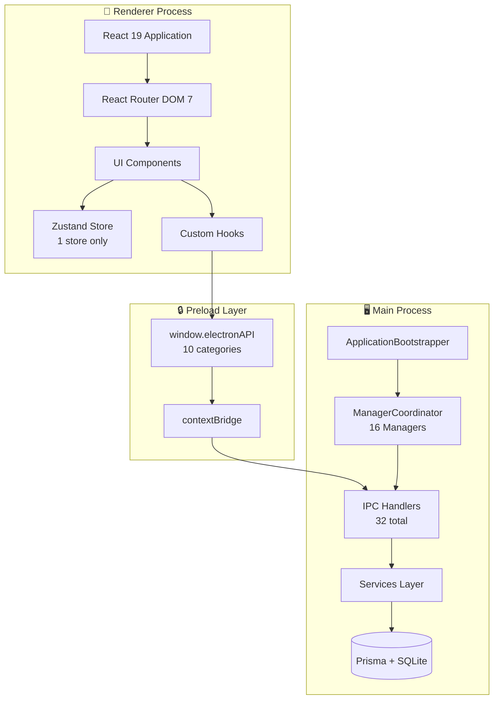
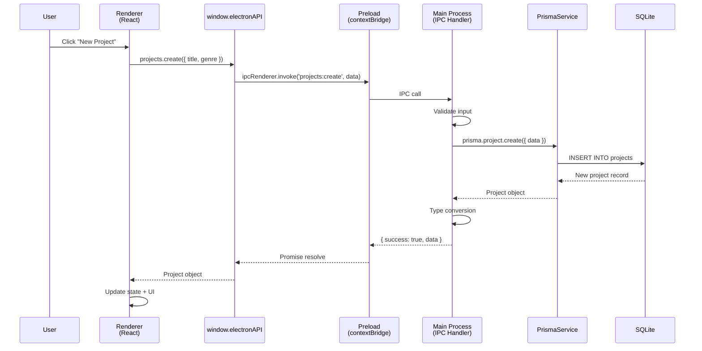
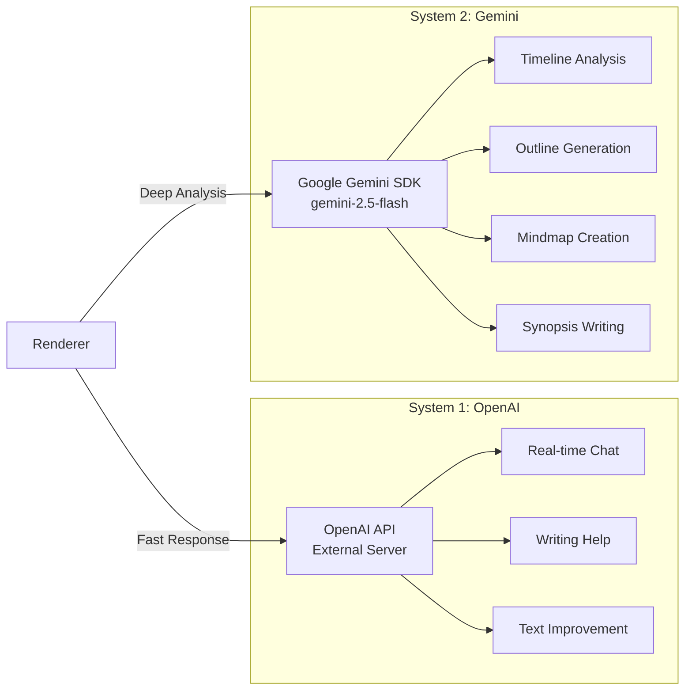

# Loop Architecture Overview

Loop is built on a modern **3-layer Electron architecture** that prioritizes security, type-safety, and maintainability.

---

## 🏗️ Core Architecture



---

## 🎯 Architecture Principles

### 1. Security-First

- **contextBridge Isolation**: Complete Node.js API blocking in renderer
- **CSP (Content Security Policy)**: Dual management for production/development
- **5-Layer Security**: CSP → Headers → Navigation Control → Logging → OAuth
- **Type-Safe IPC**: All cross-process communication is strongly typed

[Learn more →](security.md)

### 2. Type-Safe Everything

- **TypeScript Strict Mode**: No `any`, complete type coverage
- **IPC Contracts**: Defined in `/src/shared/ipc/`
- **DTOs**: Data Transfer Objects for all IPC communication
- **Prisma Types**: Auto-generated, type-safe database queries

[Learn more →](ipc-architecture.md)

### 3. Minimal State Management

- **Zustand**: Only 1 store (`useStructureStore` for ProjectStructure)
- **useState**: Server-driven lists (always fresh from DB)
- **Prisma as Truth**: Database is the single source of truth
- **No Redux/MobX**: Simplicity over complexity

[Learn more →](state-management.md)

### 4. Performance-Optimized

- **3-Phase Bootstrap**: CPU load distribution (0s/2s/4s delays)
- **Memory Management**: Auto GC, memory pools, threshold monitoring
- **6-Level Optimization**: WebGL → WebGPU → OS-specific → V8 → Network → Experimental
- **GPU Acceleration**: Hardware-accelerated video decoding

[Learn more →](../development/performance.md)

---

## 📐 Layer Breakdown

### Renderer Process (React 19)

**Purpose**: UI rendering and user interaction

**Tech Stack**:
- React 19 (concurrent features)
- React Router DOM 7 (NOT Next.js)
- TailwindCSS 3.4
- Tiptap 2.24+ (rich text)
- CodeMirror 6 (code/markdown)

**State Management**:
```typescript
// Only 1 Zustand store
const useStructureStore = create<StructureStore>(
  persist((set) => ({
    structures: {},
    loadStructuresFromDB: async (projectId) => {
      const result = await window.electronAPI.structures.getAll(projectId);
      set({ structures: { [projectId]: result } });
    }
  }), { name: 'structure-storage' })
);

// Project lists use useState (server-driven)
const [projects, setProjects] = useState<Project[]>([]);
```

**Key Files**:
- `src/renderer/main.tsx` - React root
- `src/renderer/src/routes/` - 7 routes
- `src/renderer/src/stores/useStructureStore.ts` - Only store

### Preload Layer (contextBridge)

**Purpose**: Secure API exposure between renderer and main

**Security Model**:
```typescript
// Node.js APIs are COMPLETELY BLOCKED in renderer
// Only exposed APIs are available via window.electronAPI

contextBridge.exposeInMainWorld('electronAPI', {
  projects: {
    create: (data) => ipcRenderer.invoke('projects:create', data),
    getAll: () => ipcRenderer.invoke('projects:getAll'),
    // ... 20 more project methods
  },
  ai: {
    sendMessage: (data) => ipcRenderer.invoke('ai:send-message', data),
    analyzeText: (data) => ipcRenderer.invoke('ai:analyze-text', data),
    // ... 8 more AI methods
  },
  // ... 8 more categories
});
```

**10 API Categories**:
1. `projects` (22 methods)
2. `ai` (10 methods)
3. `firebase`
4. `system`
5. `window`
6. `theme`
7. `auth`
8. `settings`
9. `clipboard`
10. `snapshot`

**Key Files**:
- `src/preload/index.ts` (548 lines) - Complete API exposure

[Learn more →](ipc-architecture.md)

### Main Process (Electron + Node.js)

**Purpose**: System integration, business logic, database access

**Bootstrap Sequence**:
```typescript
// 3-Phase Initialization (CPU load distribution)
Phase 1 (0ms):   MemoryManager, SessionManager
Phase 2 (2000ms): MenuManager, ShortcutsManager, TrayManager, UpdaterManager
Phase 3 (4000ms): BrowserDetector
```

**16 Managers**:
1. MemoryManager (real-time monitoring, auto GC)
2. SessionManager
3. MenuManager
4. ShortcutsManager
5. TrayManager
6. UpdaterManager
7. DataSyncManager
8. SecurityManager (CSP, headers, navigation)
9. WindowManager
10. ThemeManager
11. NotificationManager
12. LogManager
13. CacheManager
14. BackupManager
15. AnalyticsManager (privacy-focused)
16. BrowserDetector

**32 IPC Handlers**:
- **22 Project Handlers**: CRUD for projects, characters, structures, notes
- **10 AI Handlers**: OpenAI integration, text analysis, writing help

**Key Files**:
- `src/main/index.ts` - Entry point
- `src/main/core/ApplicationBootstrapper.ts` (463 lines)
- `src/main/core/ManagerCoordinator.ts` (400 lines)
- `src/main/handlers/projectIpcHandlers.ts` (1251 lines)
- `src/main/handlers/aiIpcHandlers.ts` (419 lines)

[Learn more →](electron-bootstrap.md)

---

## 🔄 Data Flow Example

### Creating a New Project



**Time**: ~50-100ms (local SQLite)

**Type Safety**: End-to-end TypeScript validation

---

## 🤖 AI Systems Architecture

Loop uses a **dual AI system** for specialized tasks:



**Design Decision**: Why two AI systems?
- **OpenAI**: Real-time, conversational, fast (~1-2s)
- **Gemini**: Deep analysis, structured output, slower (~10-30s)

[Learn more →](ai-systems.md)

---

## 💾 Database Architecture

**Technology**: Prisma 6 + SQLite

**Schema**:
- 17 models across 4 domains
- 36 indexes (current)
- 9 more indexes recommended

**4 Domains**:
1. **User & Settings**: Users, UserSettings, Achievement
2. **Projects**: Project, ProjectCharacter, ProjectStructure, ProjectNote
3. **Typing** (deprecated): TypingSession, KeyEvent, SessionAnalytics, AppUsage
4. **AI**: AIAnalysis, AIWorkflow, AIWorkflowStep, AIEvaluation

**Why SQLite?**
- ✅ Zero configuration
- ✅ Local-first (privacy)
- ✅ No server process
- ✅ File-based backups
- ❌ Limited JSON queries
- ❌ No multi-user writes

[Learn more →](../database/schema.md)

---

## 🔒 Security Architecture

**5-Layer Security Model**:

```
Layer 1: SecurityManager (CSP + Headers)
    ↓
Layer 2: Navigation Control (Whitelist + Blocked domains)
    ↓
Layer 3: contextBridge Isolation (No Node.js API access)
    ↓
Layer 4: Logging & Monitoring (Security violations)
    ↓
Layer 5: OAuth & Token Management (macOS Keychain)
```

**CSP Policy (Production)**:
```
default-src 'self';
script-src 'self' 'unsafe-eval';
style-src 'self' 'unsafe-inline';
img-src 'self' data: https:;
connect-src 'self' https://loop-openai.onrender.com https://firebase.google.com;
```

**7 Security Headers**:
1. X-Content-Type-Options: nosniff
2. X-Frame-Options: DENY
3. X-XSS-Protection: 1; mode=block
4. Referrer-Policy: strict-origin-when-cross-origin
5. Permissions-Policy: camera=(), microphone=(), geolocation=()
6. Strict-Transport-Security: max-age=31536000; includeSubDomains
7. Content-Security-Policy: (dynamic)

[Learn more →](security.md)

---

## 📊 Architecture Metrics

| Metric | Value | Notes |
|--------|-------|-------|
| **Processes** | 2 | Main + Renderer (single window) |
| **IPC Handlers** | 32 | 22 Project + 10 AI |
| **Managers** | 16 | Phase-based initialization |
| **Routes** | 7 | Dashboard, Projects, Editor, AI, Settings, Analyses, Auth |
| **Zustand Stores** | 1 | Only ProjectStructure |
| **Database Models** | 17 | Across 4 domains |
| **Security Layers** | 5 | Multi-layer protection |

---

## 🎨 Design Patterns

### 1. Type-Safe IPC Pattern
```typescript
// ✅ Good: Strongly typed, single responsibility
interface CreateProjectDTO {
  title: string;
  genre?: string;
  tags?: string[];
}

ipcMain.handle('projects:create', async (event, data: CreateProjectDTO) => {
  // Type-safe throughout
});
```

### 2. Hybrid State Pattern
```typescript
// ✅ Zustand for complex state (ProjectStructure)
const useStructureStore = create<StructureStore>(...);

// ✅ useState for simple lists (server-driven)
const [projects, setProjects] = useState<Project[]>([]);
```

### 3. Phase-Based Initialization Pattern
```typescript
// ✅ CPU load distribution
async initialize() {
  await initPhase1(); // Critical (0ms)
  setTimeout(() => initPhase2(), 2000); // UI (2s)
  setTimeout(() => initPhase3(), 4000); // Background (4s)
}
```

### 4. Security-First Navigation Pattern
```typescript
// ✅ Whitelist-based navigation
webContents.on('will-navigate', (event, url) => {
  if (!ALLOWED_URLS.some(allowed => url.startsWith(allowed))) {
    event.preventDefault();
    logger.warn(`Blocked: ${url}`);
  }
});
```

---

## 📚 Further Reading

- **[Electron Bootstrap](electron-bootstrap.md)** - Detailed initialization flow
- **[IPC Architecture](ipc-architecture.md)** - Complete IPC guide with examples
- **[AI Systems](ai-systems.md)** - Dual AI integration details
- **[State Management](state-management.md)** - Hybrid approach explained
- **[Security](security.md)** - 5-layer security deep dive

---

## 🎯 Architecture Goals

| Goal | Status | Notes |
|------|--------|-------|
| **Security** | ✅ Achieved | 5-layer protection, contextBridge isolation |
| **Type-Safety** | ✅ Achieved | Strict TypeScript, end-to-end |
| **Performance** | ✅ Achieved | 6-level optimization, memory management |
| **Simplicity** | ✅ Achieved | Minimal state, clear separation |
| **Maintainability** | ✅ Achieved | Modular, documented, tested |
| **Scalability** | ⚠️ Good | Single-window limitation, local DB only |

---

## 🚀 Next Steps

1. Understand the [Bootstrap Process](electron-bootstrap.md)
2. Learn [IPC Communication](ipc-architecture.md)
3. Explore [State Management](state-management.md)
4. Review [Security Practices](security.md)

---

<div align="center">

[← Back to Documentation](../README.md)

</div>
