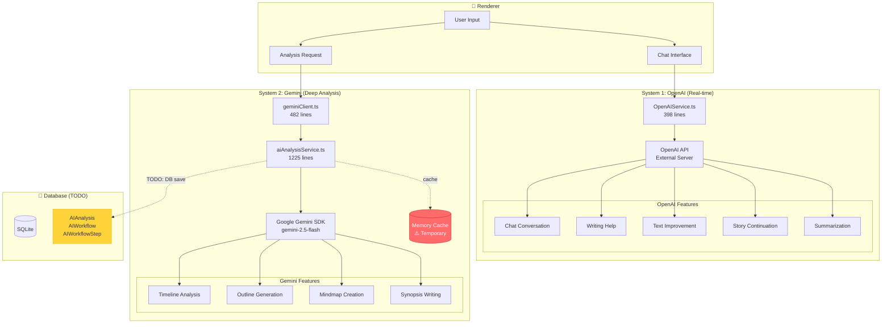

# AI Systems Architecture

Loop integrates **two specialized AI systems** for different use cases: OpenAI for real-time assistance and Gemini for deep analysis.

---

## 🤖 Dual AI System Overview



---

## 📊 System Comparison

| Feature | OpenAI | Gemini |
|---------|--------|--------|
| **Purpose** | Real-time chat | Deep analysis |
| **Response Time** | 1-3s | 10-30s |
| **Integration** | External API | Google SDK |
| **Cost** | Per token | Per token (cheaper) |
| **Use Cases** | Chat, help, improve | Timeline, outline, mindmap |
| **Storage** | No DB save | ⚠️ Memory cache only |
| **API Endpoint** | loop-openai.onrender.com | Google AI API |
| **Model** | gpt-3.5-turbo | gemini-2.5-flash |
| **Context Window** | 4K tokens | 1M tokens |
| **Streaming** | Yes | No |

---

## 🟢 System 1: OpenAI (Real-time)

### Architecture

**File**: `src/main/services/OpenAIService.ts` (398 lines)

**Purpose**: Fast, conversational AI for real-time writing assistance

**Endpoints**:
```typescript
const PRIMARY_ENDPOINT = 'https://loop-openai.onrender.com';
const FALLBACK_ENDPOINT = 'http://0.0.0.0:8080';
```

**Key Features**:
- 2 retry attempts with exponential backoff
- 60s timeout per request
- Automatic endpoint fallback
- Error handling and logging

### Core Methods

```typescript
class OpenAIService {
  /**
   * Send a chat message
   * Time: ~1-2s
   */
  async sendMessage(data: {
    message: string;
    conversationHistory?: Message[];
    projectContext?: ProjectContext;
  }): Promise<string> {
    const response = await fetch(`${this.endpoint}/api/chat`, {
      method: 'POST',
      headers: { 'Content-Type': 'application/json' },
      body: JSON.stringify({
        message: data.message,
        history: data.conversationHistory || [],
        context: data.projectContext
      }),
      signal: AbortSignal.timeout(60000)
    });

    const result = await response.json();
    return result.response;
  }

  /**
   * Analyze text for improvements
   * Time: ~2-3s
   */
  async analyzeText(text: string): Promise<AnalysisResult> {
    const response = await fetch(`${this.endpoint}/api/analyze`, {
      method: 'POST',
      body: JSON.stringify({ text })
    });

    return response.json();
  }

  /**
   * Get writing suggestions
   * Time: ~1-2s
   */
  async getWritingHelp(data: {
    text: string;
    type: 'improve' | 'continue' | 'summarize';
    tone?: string;
  }): Promise<string> {
    const response = await fetch(`${this.endpoint}/api/writing-help`, {
      method: 'POST',
      body: JSON.stringify(data)
    });

    const result = await response.json();
    return result.suggestion;
  }

  /**
   * Improve text quality
   * Time: ~2-3s
   */
  async improveText(text: string, instructions?: string): Promise<string> {
    // Implementation with retry logic
  }

  /**
   * Continue story from context
   * Time: ~3-5s (longer output)
   */
  async continueWriting(context: string, style?: string): Promise<string> {
    // Implementation
  }

  /**
   * Summarize long text
   * Time: ~2-4s
   */
  async summarizeText(text: string, maxLength?: number): Promise<string> {
    // Implementation
  }
}
```

### Usage Example

```typescript
// Renderer component
import { useState } from 'react';

function AIAssistant() {
  const [response, setResponse] = useState('');
  const [loading, setLoading] = useState(false);

  const handleChat = async (message: string) => {
    setLoading(true);
    
    const result = await window.electronAPI.ai.sendMessage({
      message,
      conversationHistory: chatHistory,
      projectContext: {
        title: currentProject.title,
        genre: currentProject.genre,
        synopsis: currentProject.synopsis
      }
    });

    if (result.success) {
      setResponse(result.data);
      setChatHistory([...chatHistory, 
        { role: 'user', content: message },
        { role: 'assistant', content: result.data }
      ]);
    }
    
    setLoading(false);
  };

  return (
    <div>
      <input 
        onSubmit={(e) => handleChat(e.target.value)} 
        disabled={loading}
      />
      {loading && <Spinner />}
      {response && <div>{response}</div>}
    </div>
  );
}
```

### Error Handling

```typescript
try {
  const response = await openAIService.sendMessage(data);
} catch (error) {
  if (error.code === 'ECONNREFUSED') {
    Logger.error('OpenAI service unavailable, trying fallback...');
    // Try fallback endpoint
  } else if (error.code === 'TIMEOUT') {
    Logger.error('OpenAI request timed out (>60s)');
  } else {
    Logger.error('OpenAI error:', error);
  }
}
```

---

## 🔵 System 2: Gemini (Deep Analysis)

### Architecture

**Files**:
- `src/shared/ai/geminiClient.ts` (482 lines) - Google AI SDK wrapper
- `src/shared/services/aiAnalysisService.ts` (1225 lines) - 8-step workflow

**Purpose**: Deep, structured analysis of writing projects

**Model**: `gemini-2.5-flash` (primary), `gemini-1.5-flash` (fallback)

**Features**:
- 8-step analysis workflow
- Token usage tracking
- Finish reason mapping
- Memory caching (⚠️ temporary)

### 8-Step Analysis Workflow

```typescript
// aiAnalysisService.ts
class AIAnalysisService {
  /**
   * Complete analysis workflow
   * Time: ~10-30s depending on project size
   */
  async analyzeProject(
    projectId: string,
    analysisType: 'timeline' | 'outline' | 'mindmap' | 'synopsis'
  ): Promise<AnalysisResult> {
    
    // Step 1: Check cache
    const cached = this.checkCache(projectId, analysisType);
    if (cached) return cached;
    
    // Step 2: Fetch project data
    const project = await this.fetchProjectData(projectId);
    
    // Step 3: Prepare context
    const context = this.prepareContext(project);
    
    // Step 4: Build prompt
    const prompt = this.buildPrompt(analysisType, context);
    
    // Step 5: Call Gemini API
    const response = await geminiClient.generateText({
      prompt,
      maxTokens: 4096,
      temperature: 0.7
    });
    
    // Step 6: Parse response
    const parsed = this.parseResponse(response, analysisType);
    
    // Step 7: Filter dummy data
    const filtered = this.filterDummyData(parsed);
    
    // Step 8: Cache result (⚠️ TODO: Save to DB)
    this.cacheResult(projectId, analysisType, filtered);
    
    // TODO: Save to database
    // await this.saveToDatabase(projectId, analysisType, filtered);
    
    return filtered;
  }
}
```

### Analysis Types

#### 1. Timeline Analysis

**Purpose**: Chronological event mapping

**Output**:
```typescript
interface TimelineAnalysis {
  events: Array<{
    id: string;
    timestamp: string;
    title: string;
    description: string;
    characters: string[];
    location: string;
    significance: 'low' | 'medium' | 'high';
  }>;
  arcs: Array<{
    id: string;
    name: string;
    startEvent: string;
    endEvent: string;
    theme: string;
  }>;
}
```

**Usage**:
```typescript
const timeline = await window.electronAPI.ai.analyzeProject({
  projectId: 'proj-123',
  type: 'timeline'
});

console.log(timeline.events.length); // e.g., 47 events
```

---

#### 2. Outline Generation

**Purpose**: Hierarchical story structure

**Output**:
```typescript
interface OutlineAnalysis {
  structure: {
    act1: {
      chapters: Array<{
        number: number;
        title: string;
        scenes: Array<{
          setting: string;
          characters: string[];
          events: string[];
        }>;
      }>;
    };
    act2: { /* ... */ };
    act3: { /* ... */ };
  };
}
```

---

#### 3. Mindmap Creation

**Purpose**: Concept relationship mapping

**Output**:
```typescript
interface MindmapAnalysis {
  nodes: Array<{
    id: string;
    label: string;
    type: 'character' | 'theme' | 'location' | 'event';
    importance: number; // 1-10
  }>;
  edges: Array<{
    source: string;
    target: string;
    relationship: string;
    strength: number; // 1-10
  }>;
}
```

---

#### 4. Synopsis Writing

**Purpose**: Story summary generation

**Output**:
```typescript
interface SynopsisAnalysis {
  short: string;      // 100 words
  medium: string;     // 500 words
  long: string;       // 1000 words
  themes: string[];
  tone: string;
  targetAudience: string;
}
```

---

### Gemini Client Implementation

```typescript
// geminiClient.ts
import { GoogleGenerativeAI } from '@google/generative-ai';

class GeminiClient {
  private genAI: GoogleGenerativeAI;
  private model: GenerativeModel;

  constructor(apiKey: string) {
    this.genAI = new GoogleGenerativeAI(apiKey);
    this.model = this.genAI.getGenerativeModel({ 
      model: 'gemini-2.5-flash' 
    });
  }

  async generateText(options: {
    prompt: string;
    maxTokens?: number;
    temperature?: number;
  }): Promise<string> {
    try {
      const result = await this.model.generateContent({
        contents: [{ role: 'user', parts: [{ text: options.prompt }] }],
        generationConfig: {
          maxOutputTokens: options.maxTokens || 2048,
          temperature: options.temperature || 0.7,
        }
      });

      const response = result.response;
      
      // Track token usage
      this.trackTokenUsage({
        promptTokens: response.usageMetadata?.promptTokenCount || 0,
        completionTokens: response.usageMetadata?.candidatesTokenCount || 0,
        totalTokens: response.usageMetadata?.totalTokenCount || 0
      });

      return response.text();
    } catch (error) {
      if (error.message.includes('quota')) {
        Logger.error('Gemini quota exceeded');
        throw new QuotaExceededError();
      }
      throw error;
    }
  }

  private trackTokenUsage(usage: TokenUsage): void {
    // Store in database for cost tracking
    Logger.info('Gemini token usage:', usage);
  }
}
```

---

## ⚠️ Critical Issue: Missing DB Persistence

### Current State (Memory Cache Only)

```typescript
// aiAnalysisService.ts
private cache: Map<string, AnalysisResult> = new Map();

cacheResult(projectId: string, type: string, result: AnalysisResult): void {
  const key = `${projectId}-${type}`;
  this.cache.set(key, result);
  // ⚠️ Lost on app restart!
}
```

### Required Fix (DB Persistence)

```typescript
// TODO: Implement this!
async saveToDatabase(
  projectId: string, 
  type: string, 
  result: AnalysisResult
): Promise<void> {
  const prisma = PrismaService.getClient();
  
  await prisma.aIAnalysis.create({
    data: {
      projectId,
      type,
      result: JSON.stringify(result),
      model: 'gemini-2.5-flash',
      tokensUsed: result.tokensUsed,
      createdAt: new Date()
    }
  });
  
  await prisma.$disconnect();
}
```

**Impact**: Without DB persistence, all Gemini analysis results are lost on app restart!

---

## 🎯 Design Decisions

### Why Two AI Systems?

| Criteria | OpenAI | Gemini | Winner |
|----------|--------|--------|--------|
| **Speed** | 1-3s | 10-30s | OpenAI |
| **Cost** | $$$ | $$ | Gemini |
| **Context** | 4K tokens | 1M tokens | Gemini |
| **Streaming** | Yes | No | OpenAI |
| **Real-time Chat** | Perfect | Poor | OpenAI |
| **Deep Analysis** | Good | Excellent | Gemini |

**Conclusion**: Use both for optimal experience!

---

### Why External OpenAI Server?

**Advantages**:
- API key security (not in client)
- Rate limiting control
- Caching layer
- Request logging
- Cost tracking

**Disadvantages**:
- Additional infrastructure
- Network dependency
- Deployment complexity

**Score**: 8/10 - Good trade-off

---

### Why Gemini Google SDK?

**Advantages**:
- Official SDK (reliable)
- Type-safe (TypeScript)
- Auto-retry logic
- Token tracking
- Large context window (1M tokens)

**Disadvantages**:
- API key in client (mitigated by main process only)
- No server-side caching
- Quota limits

**Score**: 8/10 - Good choice for deep analysis

---

## 📊 Performance Optimization

### 1. Caching Strategy

```typescript
// Cache for 1 hour
const CACHE_TTL = 60 * 60 * 1000;

interface CacheEntry {
  result: AnalysisResult;
  timestamp: number;
}

checkCache(projectId: string, type: string): AnalysisResult | null {
  const entry = this.cache.get(`${projectId}-${type}`);
  
  if (!entry) return null;
  
  const age = Date.now() - entry.timestamp;
  if (age > CACHE_TTL) {
    this.cache.delete(`${projectId}-${type}`);
    return null;
  }
  
  return entry.result;
}
```

### 2. Batch Requests

```typescript
// Instead of 4 separate calls:
await analyzeProject(id, 'timeline');
await analyzeProject(id, 'outline');
await analyzeProject(id, 'mindmap');
await analyzeProject(id, 'synopsis');

// Use batch:
await batchAnalyzeProject(id, ['timeline', 'outline', 'mindmap', 'synopsis']);
// Saves ~30% on token usage by sharing context
```

### 3. Progressive Loading

```typescript
// Start with fast analysis
const quickAnalysis = await analyzeProject(id, 'synopsis');
setResult(quickAnalysis);

// Then load detailed analysis
const detailedAnalysis = await analyzeProject(id, 'timeline');
setResult({ ...quickAnalysis, ...detailedAnalysis });
```

---

## 🐛 Debugging

### Enable AI Logging

```typescript
// Set environment variable
AI_DEBUG=true pnpm dev

// Output:
// [AI] OpenAI request: /api/chat (1.2s)
// [AI] Gemini request: timeline analysis (23.4s)
// [AI] Token usage: 1543 prompt + 2047 completion = 3590 total
```

### Monitor Token Usage

```typescript
// Get token usage stats
const stats = await window.electronAPI.ai.getTokenUsage();

console.table(stats);
// ┌─────────┬──────────┬────────────┬──────┐
// │ Service │ Requests │ Tokens     │ Cost │
// ├─────────┼──────────┼────────────┼──────┤
// │ OpenAI  │ 142      │ 458,234    │ $2.31│
// │ Gemini  │ 23       │ 1,234,567  │ $0.62│
// └─────────┴──────────┴────────────┴──────┘
```

---

## 🔗 Related Documentation

- [IPC Architecture](ipc-architecture.md) - How AI calls work
- [Database Schema](../database/schema.md) - AIAnalysis model
- [Performance](../development/performance.md) - Optimization tips

---

<div align="center">

[← Back to Architecture](README.md) | [Next: State Management →](state-management.md)

</div>
