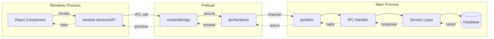

# IPC Architecture

Loop uses a **type-safe, security-focused IPC system** for communication between the Renderer and Main processes.

---

## 🎯 IPC Overview



---

## 📊 IPC Statistics

| Category | Count | Lines of Code |
|----------|-------|---------------|
| **Total IPC Handlers** | 32 | ~1,670 |
| Project Handlers | 22 | 1,251 |
| AI Handlers | 10 | 419 |
| **API Categories** | 10 | - |
| **Exposed Methods** | 100+ | 548 (preload) |

---

## 🔒 Security Layer (Preload)

### src/preload/index.ts (548 lines)

**Purpose**: Secure API exposure using `contextBridge`

**Key Principle**: **No direct Node.js API access in Renderer**

```typescript
import { contextBridge, ipcRenderer } from 'electron';

// ❌ This is BLOCKED in renderer:
// const fs = require('fs');  // Error!
// const { exec } = require('child_process');  // Error!

// ✅ Only these APIs are exposed:
contextBridge.exposeInMainWorld('electronAPI', {
  // 1. Projects API (22 methods)
  projects: {
    create: (data: CreateProjectDTO) => 
      ipcRenderer.invoke('projects:create', data),
    
    getAll: () => 
      ipcRenderer.invoke('projects:getAll'),
    
    getById: (id: string) => 
      ipcRenderer.invoke('projects:getById', id),
    
    update: (id: string, data: UpdateProjectDTO) => 
      ipcRenderer.invoke('projects:update', id, data),
    
    delete: (id: string) => 
      ipcRenderer.invoke('projects:delete', id),
    
    // ... 17 more methods
  },

  // 2. AI API (10 methods)
  ai: {
    sendMessage: (data: SendMessageDTO) => 
      ipcRenderer.invoke('ai:send-message', data),
    
    analyzeText: (data: AnalyzeTextDTO) => 
      ipcRenderer.invoke('ai:analyze-text', data),
    
    getWritingHelp: (data: WritingHelpDTO) => 
      ipcRenderer.invoke('ai:get-writing-help', data),
    
    // ... 7 more methods
  },

  // 3. Firebase API
  firebase: {
    signIn: (email: string, password: string) => 
      ipcRenderer.invoke('firebase:sign-in', email, password),
    
    signOut: () => 
      ipcRenderer.invoke('firebase:sign-out'),
    
    // ... more methods
  },

  // 4. System API
  system: {
    getVersion: () => ipcRenderer.invoke('system:get-version'),
    getPlatform: () => ipcRenderer.invoke('system:get-platform'),
    openExternal: (url: string) => ipcRenderer.invoke('system:open-external', url),
  },

  // 5. Window API
  window: {
    minimize: () => ipcRenderer.invoke('window:minimize'),
    maximize: () => ipcRenderer.invoke('window:maximize'),
    close: () => ipcRenderer.invoke('window:close'),
  },

  // 6-10: Theme, Auth, Settings, Clipboard, Snapshot
  // ... (see full preload/index.ts)
});
```

---

## 📝 22 Project IPC Handlers

### src/main/handlers/projectIpcHandlers.ts (1,251 lines)

**Pattern**: Try-Catch → Logger → PrismaService → Operation → Type Conversion → Disconnect

```typescript
import { ipcMain } from 'electron';
import { PrismaService } from '../services/PrismaService';
import { Logger } from '../utils/Logger';

// ✅ Type-Safe Handler Pattern
ipcMain.handle('projects:create', async (event, data: CreateProjectDTO) => {
  try {
    Logger.info('Creating project', { data });
    
    const prisma = PrismaService.getClient();
    
    const project = await prisma.project.create({
      data: {
        title: data.title,
        genre: data.genre,
        tags: data.tags || [],
        userId: data.userId,
        createdAt: new Date(),
        updatedAt: new Date()
      },
      include: {
        characters: true,
        structures: true,
        notes: true
      }
    });
    
    await prisma.$disconnect();
    
    Logger.info('Project created', { projectId: project.id });
    
    return {
      success: true,
      data: project
    };
  } catch (error) {
    Logger.error('Failed to create project', error);
    return {
      success: false,
      error: error.message
    };
  }
});
```

### Complete Project Handler List

1. **CRUD Operations** (5)
   - `projects:create` - Create new project
   - `projects:getAll` - Get all projects
   - `projects:getById` - Get single project
   - `projects:update` - Update project
   - `projects:delete` - Delete project

2. **Character Management** (5)
   - `projects:characters:create`
   - `projects:characters:getAll`
   - `projects:characters:update`
   - `projects:characters:delete`
   - `projects:characters:linkToProject`

3. **Structure Management** (5)
   - `projects:structures:create`
   - `projects:structures:getAll`
   - `projects:structures:update`
   - `projects:structures:delete`
   - `projects:structures:reorder`

4. **Notes Management** (4)
   - `projects:notes:create`
   - `projects:notes:getAll`
   - `projects:notes:update`
   - `projects:notes:delete`

5. **Batch Operations** (3)
   - `projects:batch-update`
   - `projects:batch-delete`
   - `projects:export`

---

## 🤖 10 AI IPC Handlers

### src/main/handlers/aiIpcHandlers.ts (419 lines)

**Pattern**: Input Validation → OpenAIService → Error Handling

```typescript
ipcMain.handle('ai:send-message', async (event, data: SendMessageDTO) => {
  try {
    Logger.info('AI: Sending message', { 
      messageLength: data.message.length 
    });
    
    const response = await openAIService.sendMessage({
      message: data.message,
      conversationHistory: data.conversationHistory || [],
      projectContext: data.projectContext
    });
    
    return {
      success: true,
      data: response
    };
  } catch (error) {
    Logger.error('AI: Failed to send message', error);
    return {
      success: false,
      error: error.message
    };
  }
});
```

### Complete AI Handler List

1. `ai:send-message` - Chat conversation
2. `ai:analyze-text` - Text analysis
3. `ai:get-writing-help` - Writing suggestions
4. `ai:improve-text` - Text improvement
5. `ai:continue-writing` - Story continuation
6. `ai:summarize-text` - Text summarization
7. `ai:generate-title` - Title generation
8. `ai:check-grammar` - Grammar checking
9. `ai:translate` - Text translation
10. `ai:get-synonyms` - Synonym suggestions

---

## 🎨 Usage Examples

### 1. Creating a Project (Full Flow)

#### Renderer (React Component)
```typescript
// src/renderer/src/routes/Projects.tsx
import { useState } from 'react';

function ProjectsPage() {
  const [projects, setProjects] = useState<Project[]>([]);

  const handleCreateProject = async () => {
    try {
      const result = await window.electronAPI.projects.create({
        title: 'My New Novel',
        genre: 'Fantasy',
        tags: ['magic', 'adventure'],
        userId: currentUser.id
      });

      if (result.success) {
        setProjects([...projects, result.data]);
        console.log('✅ Project created:', result.data);
      } else {
        console.error('❌ Failed:', result.error);
      }
    } catch (error) {
      console.error('❌ Exception:', error);
    }
  };

  return (
    <button onClick={handleCreateProject}>
      Create Project
    </button>
  );
}
```

#### Preload (contextBridge)
```typescript
// src/preload/index.ts
contextBridge.exposeInMainWorld('electronAPI', {
  projects: {
    create: (data: CreateProjectDTO) => 
      ipcRenderer.invoke('projects:create', data)
  }
});
```

#### Main (IPC Handler)
```typescript
// src/main/handlers/projectIpcHandlers.ts
ipcMain.handle('projects:create', async (event, data) => {
  const prisma = PrismaService.getClient();
  const project = await prisma.project.create({ data });
  await prisma.$disconnect();
  return { success: true, data: project };
});
```

**Time**: ~50-100ms (local SQLite)

---

### 2. AI Writing Help

#### Renderer
```typescript
// src/renderer/src/components/AIAssistant.tsx
const getWritingHelp = async (text: string) => {
  const result = await window.electronAPI.ai.getWritingHelp({
    text,
    type: 'improve',
    tone: 'professional'
  });

  if (result.success) {
    console.log('AI Suggestion:', result.data.suggestion);
  }
};
```

#### Main
```typescript
// src/main/handlers/aiIpcHandlers.ts
ipcMain.handle('ai:get-writing-help', async (event, data) => {
  const response = await openAIService.getWritingHelp(data);
  return { success: true, data: response };
});
```

**Time**: ~1-3s (external OpenAI API)

---

### 3. Batch Operations

#### Renderer
```typescript
// Batch delete multiple projects
const deleteMultiple = async (projectIds: string[]) => {
  const result = await window.electronAPI.projects.batchDelete({
    ids: projectIds
  });

  console.log(`Deleted ${result.data.count} projects`);
};
```

#### Main
```typescript
ipcMain.handle('projects:batch-delete', async (event, data) => {
  const prisma = PrismaService.getClient();
  
  const result = await prisma.project.deleteMany({
    where: {
      id: { in: data.ids }
    }
  });
  
  await prisma.$disconnect();
  
  return {
    success: true,
    data: { count: result.count }
  };
});
```

---

## 🏗️ Type Definitions

### DTOs (Data Transfer Objects)

```typescript
// src/shared/types/project.ts

export interface CreateProjectDTO {
  title: string;
  genre?: string;
  tags?: string[];
  userId: string;
}

export interface UpdateProjectDTO {
  title?: string;
  genre?: string;
  tags?: string[];
  wordCount?: number;
}

export interface Project {
  id: string;
  title: string;
  genre: string | null;
  tags: string[];
  wordCount: number;
  createdAt: Date;
  updatedAt: Date;
  userId: string;
}

// AI Types
export interface SendMessageDTO {
  message: string;
  conversationHistory?: Message[];
  projectContext?: ProjectContext;
}

export interface AnalyzeTextDTO {
  text: string;
  analysisType: 'grammar' | 'style' | 'sentiment';
}
```

---

## 🛡️ Security Best Practices

### 1. ✅ Always Use contextBridge

```typescript
// ❌ Bad: Direct exposure (SECURITY RISK!)
window.electronAPI = {
  fs: require('fs'),
  exec: require('child_process').exec
};

// ✅ Good: Controlled exposure
contextBridge.exposeInMainWorld('electronAPI', {
  readFile: (path: string) => ipcRenderer.invoke('fs:read', path)
});
```

### 2. ✅ Validate All Inputs

```typescript
// ✅ Validate in Main process
ipcMain.handle('projects:create', async (event, data) => {
  // Validate
  if (!data.title || data.title.length < 1) {
    return { success: false, error: 'Title required' };
  }
  
  if (data.title.length > 200) {
    return { success: false, error: 'Title too long' };
  }
  
  // Proceed with creation
});
```

### 3. ✅ Use TypeScript

```typescript
// ✅ Type-safe throughout
interface IPC_Response<T> {
  success: boolean;
  data?: T;
  error?: string;
}

ipcMain.handle('projects:create', 
  async (event, data: CreateProjectDTO): Promise<IPC_Response<Project>> => {
    // TypeScript enforces types
  }
);
```

---

## 🐛 Debugging IPC

### Enable IPC Logging

```typescript
// src/main/handlers/projectIpcHandlers.ts
ipcMain.handle('projects:create', async (event, data) => {
  console.log('📥 IPC IN:', 'projects:create', data);
  
  const result = await createProject(data);
  
  console.log('📤 IPC OUT:', 'projects:create', result);
  
  return result;
});
```

### Monitor IPC Traffic (Renderer DevTools)

```typescript
// In DevTools Console
window.electronAPI.projects.create({ title: 'Test' })
  .then(result => console.log('Result:', result));

// Output:
// 📥 IPC IN: projects:create { title: 'Test' }
// [Prisma] INSERT INTO projects...
// 📤 IPC OUT: projects:create { success: true, data: {...} }
// Result: { success: true, data: {...} }
```

---

## ⚠️ Common Mistakes

### ❌ Mistake 1: Forgetting $disconnect()

```typescript
// ❌ Bad: Memory leak!
ipcMain.handle('projects:getAll', async () => {
  const prisma = PrismaService.getClient();
  const projects = await prisma.project.findMany();
  return { success: true, data: projects };
  // Missing: await prisma.$disconnect();
});

// ✅ Good
ipcMain.handle('projects:getAll', async () => {
  const prisma = PrismaService.getClient();
  const projects = await prisma.project.findMany();
  await prisma.$disconnect();  // ✅ Always disconnect!
  return { success: true, data: projects };
});
```

---

### ❌ Mistake 2: No Error Handling

```typescript
// ❌ Bad: Crashes main process!
ipcMain.handle('projects:create', async (event, data) => {
  const prisma = PrismaService.getClient();
  const project = await prisma.project.create({ data });
  return { success: true, data: project };
});

// ✅ Good: Graceful error handling
ipcMain.handle('projects:create', async (event, data) => {
  try {
    const prisma = PrismaService.getClient();
    const project = await prisma.project.create({ data });
    await prisma.$disconnect();
    return { success: true, data: project };
  } catch (error) {
    Logger.error('Failed to create project', error);
    return { success: false, error: error.message };
  }
});
```

---

### ❌ Mistake 3: Exposing Sensitive APIs

```typescript
// ❌ DANGER: Never expose these!
contextBridge.exposeInMainWorld('electronAPI', {
  exec: (cmd: string) => require('child_process').exec(cmd),
  readFile: (path: string) => require('fs').readFileSync(path),
  // This allows arbitrary code execution!
});

// ✅ Safe: Controlled, validated APIs
contextBridge.exposeInMainWorld('electronAPI', {
  readProjectFile: (projectId: string) => 
    ipcRenderer.invoke('projects:read-file', projectId)
  // Main process validates projectId and path
});
```

---

## 📊 Performance Tips

### 1. Batch Operations When Possible

```typescript
// ❌ Slow: Multiple IPC calls
for (const id of projectIds) {
  await window.electronAPI.projects.delete(id);
}
// Time: N * 50ms = 500ms for 10 projects

// ✅ Fast: Single batch call
await window.electronAPI.projects.batchDelete({ ids: projectIds });
// Time: 50ms for 10 projects (10x faster!)
```

### 2. Use Debouncing for Frequent Updates

```typescript
// ✅ Debounce auto-save
import { debounce } from 'lodash';

const debouncedSave = debounce(async (data) => {
  await window.electronAPI.projects.update(projectId, data);
}, 1000);

// Called every keystroke, but only saves after 1s of inactivity
onChange={(e) => debouncedSave({ content: e.target.value })}
```

### 3. Include Related Data

```typescript
// ❌ Slow: N+1 queries
const project = await window.electronAPI.projects.getById(id);
const characters = await window.electronAPI.projects.characters.getAll(id);
const structures = await window.electronAPI.projects.structures.getAll(id);
// 3 IPC calls, 3 DB queries

// ✅ Fast: Single query with includes
const project = await window.electronAPI.projects.getById(id, {
  include: ['characters', 'structures', 'notes']
});
// 1 IPC call, 1 DB query with includes
```

---

## 🧪 Testing IPC

### Unit Test (Main Process)

```typescript
// test/unit/handlers/projectIpcHandlers.test.ts
import { ipcMain } from 'electron';

describe('Project IPC Handlers', () => {
  it('should create project', async () => {
    const data = {
      title: 'Test Project',
      genre: 'Fantasy',
      userId: 'user-123'
    };

    const result = await simulateIPC('projects:create', data);

    expect(result.success).toBe(true);
    expect(result.data.title).toBe('Test Project');
  });
});
```

### Integration Test (Renderer → Main)

```typescript
// test/e2e/ipc.spec.ts
import { test, expect } from '@playwright/test';

test('should create and retrieve project', async ({ page }) => {
  // Create project
  const createResult = await page.evaluate(async () => {
    return window.electronAPI.projects.create({
      title: 'E2E Test Project',
      userId: 'test-user'
    });
  });

  expect(createResult.success).toBe(true);

  // Retrieve project
  const getResult = await page.evaluate(async (id) => {
    return window.electronAPI.projects.getById(id);
  }, createResult.data.id);

  expect(getResult.data.title).toBe('E2E Test Project');
});
```

---

## 📚 Further Reading

- [Electron IPC Documentation](https://www.electronjs.org/docs/latest/tutorial/ipc)
- [contextBridge Security](https://www.electronjs.org/docs/latest/api/context-bridge)
- [Prisma Best Practices](https://www.prisma.io/docs/guides/performance-and-optimization)
- [TypeScript Handbook](https://www.typescriptlang.org/docs/)

---

<div align="center">

[← Back to Architecture](README.md) | [Next: AI Systems →](ai-systems.md)

</div>
