# Security Architecture

Loop implements a **5-layer security system** to protect user data and prevent unauthorized access.

---

## 🛡️ Security Layers Overview

```mermaid
graph TB
    subgraph "Layer 1: SecurityManager"
        CSP[Content Security Policy<br/>Production + Development]
        Headers[7 Security Headers]
    end
    
    subgraph "Layer 2: Navigation Control"
        Nav[will-navigate Event]
        Win[Window Open Handler]
        Whitelist[Allowed URLs]
        Blocklist[Blocked Domains]
    end
    
    subgraph "Layer 3: contextBridge Isolation"
        Bridge[contextBridge API]
        NodeBlock[❌ Node.js APIs Blocked]
        Expose[✅ Safe APIs Only]
    end
    
    subgraph "Layer 4: Logging & Monitoring"
        ViolationLog[Security Violations<br/>Max 100 records]
        Audit[Audit Trail]
    end
    
    subgraph "Layer 5: OAuth & Token Management"
        Keychain[macOS Keychain<br/>Windows Credential Manager]
        Firebase[Firebase Auth]
        Tokens[OAuth Tokens]
    end
    
    CSP --> Headers
    Headers --> Nav
    Nav --> Win
    Win --> Whitelist
    Whitelist --> Blocklist
    Blocklist --> Bridge
    Bridge --> NodeBlock
    NodeBlock --> Expose
    Expose --> ViolationLog
    ViolationLog --> Audit
    Audit --> Keychain
    Keychain --> Firebase
    Firebase --> Tokens
```



---

## 🔒 Layer 1: SecurityManager

**File**: `src/main/core/security.ts` (398 lines)

**Purpose**: Central security configuration and enforcement

### Content Security Policy (CSP)

#### Production Mode (Strict)

```typescript
const productionCSP = {
  defaultSrc: ["'self'"],
  scriptSrc: ["'self'"],
  styleSrc: ["'self'", "'unsafe-inline'"], // TailwindCSS needs inline
  imgSrc: ["'self'", "data:", "https:"],
  connectSrc: [
    "'self'",
    "https://loop-openai.onrender.com",
    "https://firebase.google.com",
    "https://firebaseapp.com",
    "https://googleapis.com"
  ],
  fontSrc: ["'self'", "data:"],
  objectSrc: ["'none'"],
  mediaSrc: ["'self'"],
  frameSrc: ["'none'"]
};
```

#### Development Mode (Relaxed)

```typescript
const developmentCSP = {
  ...productionCSP,
  scriptSrc: ["'self'", "'unsafe-eval'"], // Vite HMR needs eval
  connectSrc: [
    ...productionCSP.connectSrc,
    "ws://localhost:5173",  // Vite WebSocket
    "http://localhost:5173" // Vite dev server
  ]
};
```

### 7 Security Headers

```typescript
class SecurityManager {
  static setupSecurityHeaders(session: Session): void {
    session.webRequest.onHeadersReceived((details, callback) => {
      callback({
        responseHeaders: {
          ...details.responseHeaders,
          
          // 1. Prevent MIME sniffing
          'X-Content-Type-Options': ['nosniff'],
          
          // 2. Prevent clickjacking
          'X-Frame-Options': ['DENY'],
          
          // 3. Enable XSS protection
          'X-XSS-Protection': ['1; mode=block'],
          
          // 4. Referrer policy
          'Referrer-Policy': ['strict-origin-when-cross-origin'],
          
          // 5. Permissions policy
          'Permissions-Policy': [
            'camera=(), microphone=(), geolocation=()'
          ],
          
          // 6. HSTS (HTTPS only)
          'Strict-Transport-Security': [
            'max-age=31536000; includeSubDomains'
          ],
          
          // 7. CSP (dynamic)
          'Content-Security-Policy': [
            this.generateCSP()
          ]
        }
      });
    });
  }
  
  private static generateCSP(): string {
    const csp = isDev ? developmentCSP : productionCSP;
    
    return Object.entries(csp)
      .map(([key, values]) => {
        const directive = key.replace(/[A-Z]/g, '-$&').toLowerCase();
        return `${directive} ${values.join(' ')}`;
      })
      .join('; ');
  }
}
```

---

## 🚫 Layer 2: Navigation Control

### URL Whitelist

```typescript
const ALLOWED_URLS = [
  'https://loop-openai.onrender.com',
  'https://firebase.google.com',
  'https://firebaseapp.com',
  'https://accounts.google.com',
  'https://github.com',
  'http://localhost:5173', // Dev only
  'http://localhost:8080'  // Dev only
];

webContents.on('will-navigate', (event, navigationUrl) => {
  const isAllowed = ALLOWED_URLS.some(allowed => 
    navigationUrl.startsWith(allowed)
  );
  
  if (!isAllowed) {
    event.preventDefault();
    
    Logger.warn('Blocked navigation:', {
      url: navigationUrl,
      timestamp: new Date().toISOString()
    });
    
    SecurityManager.logViolation({
      type: 'navigation',
      url: navigationUrl,
      blocked: true
    });
  }
});
```

### Blocked Domains

```typescript
const BLOCKED_DOMAINS = [
  'google-analytics.com',
  'googletagmanager.com',
  'facebook.com',
  'doubleclick.net',
  'adservice.google.com',
  'analytics.google.com',
  // ... more tracking domains
];

webContents.session.webRequest.onBeforeRequest((details, callback) => {
  const url = new URL(details.url);
  const isBlocked = BLOCKED_DOMAINS.some(domain => 
    url.hostname.includes(domain)
  );
  
  if (isBlocked) {
    Logger.info('Blocked tracking request:', url.hostname);
    callback({ cancel: true });
  } else {
    callback({ cancel: false });
  }
});
```

### Window Open Handler

```typescript
webContents.setWindowOpenHandler(({ url }) => {
  // Block popups unless explicitly allowed
  const isAllowed = ALLOWED_URLS.some(allowed => url.startsWith(allowed));
  
  if (isAllowed) {
    shell.openExternal(url); // Open in system browser
  } else {
    Logger.warn('Blocked popup:', url);
  }
  
  return { action: 'deny' }; // Never open new Electron window
});
```

---

## 🔐 Layer 3: contextBridge Isolation

### Complete Node.js API Blocking

```typescript
// webPreferences in BrowserWindow
{
  contextIsolation: true,  // ✅ Enable contextBridge
  nodeIntegration: false,  // ❌ Disable Node.js
  sandbox: true,           // ✅ Enable OS-level sandbox
  webSecurity: true        // ✅ Enforce same-origin policy
}
```

### Safe API Exposure

**File**: `src/preload/index.ts` (548 lines)

```typescript
// ❌ These are BLOCKED in renderer:
// require('fs')
// require('child_process')
// require('net')
// require('crypto')
// process.env
// __dirname

// ✅ Only these are exposed:
contextBridge.exposeInMainWorld('electronAPI', {
  // Safe, validated APIs only
  projects: {
    create: (data) => ipcRenderer.invoke('projects:create', data),
    // ... validated operations
  },
  
  // NO direct file system access
  // NO command execution
  // NO network access
  // NO process manipulation
});
```

---

## 📊 Layer 4: Logging & Monitoring

### Security Violation Logging

```typescript
interface SecurityViolation {
  type: 'navigation' | 'csp' | 'popup' | 'request';
  url: string;
  timestamp: string;
  blocked: boolean;
  details?: any;
}

class SecurityManager {
  private static violations: SecurityViolation[] = [];
  private static MAX_VIOLATIONS = 100;
  
  static logViolation(violation: SecurityViolation): void {
    this.violations.push({
      ...violation,
      timestamp: new Date().toISOString()
    });
    
    // Keep only last 100 violations
    if (this.violations.length > this.MAX_VIOLATIONS) {
      this.violations.shift();
    }
    
    // Alert on suspicious patterns
    this.analyzeViolations();
  }
  
  static analyzeViolations(): void {
    const recentViolations = this.violations.filter(v => {
      const age = Date.now() - new Date(v.timestamp).getTime();
      return age < 60000; // Last minute
    });
    
    if (recentViolations.length > 10) {
      Logger.error('⚠️ High rate of security violations detected!');
      // Could trigger additional security measures
    }
  }
  
  static getViolations(): SecurityViolation[] {
    return [...this.violations]; // Return copy
  }
}
```

### CSP Violation Reporting

```typescript
webContents.on('did-finish-load', () => {
  webContents.executeJavaScript(`
    document.addEventListener('securitypolicyviolation', (e) => {
      console.error('CSP Violation:', {
        violatedDirective: e.violatedDirective,
        blockedURI: e.blockedURI,
        originalPolicy: e.originalPolicy
      });
    });
  `);
});
```

---

## 🔑 Layer 5: OAuth & Token Management

### macOS Keychain Integration

```typescript
import keytar from 'keytar';

class TokenManager {
  private static SERVICE_NAME = 'Loop';
  
  static async saveToken(
    account: string, 
    token: string
  ): Promise<void> {
    await keytar.setPassword(this.SERVICE_NAME, account, token);
    Logger.info('Token saved to keychain:', account);
  }
  
  static async getToken(account: string): Promise<string | null> {
    return await keytar.getPassword(this.SERVICE_NAME, account);
  }
  
  static async deleteToken(account: string): Promise<void> {
    await keytar.deletePassword(this.SERVICE_NAME, account);
    Logger.info('Token deleted from keychain:', account);
  }
}
```

### Firebase Authentication

```typescript
import { getAuth, signInWithEmailAndPassword } from 'firebase/auth';

class FirebaseAuthService {
  private auth = getAuth();
  
  async signIn(email: string, password: string): Promise<User> {
    try {
      const userCredential = await signInWithEmailAndPassword(
        this.auth, 
        email, 
        password
      );
      
      // Store token securely
      const token = await userCredential.user.getIdToken();
      await TokenManager.saveToken(email, token);
      
      return userCredential.user;
    } catch (error) {
      Logger.error('Firebase sign-in failed:', error);
      throw error;
    }
  }
  
  async signOut(): Promise<void> {
    const user = this.auth.currentUser;
    
    if (user) {
      await TokenManager.deleteToken(user.email!);
    }
    
    await this.auth.signOut();
  }
}
```

---

## 🎯 Security Best Practices

### 1. ✅ Never Store Secrets in Code

```typescript
// ❌ Bad: Hardcoded API key
const OPENAI_API_KEY = 'sk-1234567890abcdef';

// ✅ Good: Environment variable
const OPENAI_API_KEY = process.env.OPENAI_API_KEY;

// ✅ Better: Keychain storage
const OPENAI_API_KEY = await TokenManager.getToken('openai-api-key');
```

---

### 2. ✅ Validate All User Input

```typescript
// ✅ Validate in Main process
ipcMain.handle('projects:create', async (event, data) => {
  // Sanitize input
  const sanitized = {
    title: sanitize(data.title),
    genre: sanitize(data.genre),
    tags: data.tags?.map(tag => sanitize(tag)) || []
  };
  
  // Validate
  if (!sanitized.title || sanitized.title.length < 1) {
    return { success: false, error: 'Invalid title' };
  }
  
  if (sanitized.title.length > 200) {
    return { success: false, error: 'Title too long' };
  }
  
  // Proceed
});
```

---

### 3. ✅ Use HTTPS Only

```typescript
// ✅ Force HTTPS in production
if (!isDev) {
  const allowedProtocols = ['https:', 'loop:'];
  
  webContents.on('will-navigate', (event, url) => {
    const protocol = new URL(url).protocol;
    
    if (!allowedProtocols.includes(protocol)) {
      event.preventDefault();
      Logger.warn('Blocked non-HTTPS navigation:', url);
    }
  });
}
```

---

### 4. ✅ Disable Remote Module

```typescript
// ✅ Already disabled by default in Electron 38
{
  webPreferences: {
    enableRemoteModule: false // Not needed, but explicit
  }
}
```

---

### 5. ✅ Sanitize File Paths

```typescript
import path from 'path';

// ❌ Bad: Path traversal vulnerability
ipcMain.handle('read-file', async (event, filePath) => {
  return fs.readFileSync(filePath);
  // User could pass '../../../etc/passwd'!
});

// ✅ Good: Validate and restrict paths
ipcMain.handle('read-file', async (event, filePath) => {
  const basePath = app.getPath('userData');
  const fullPath = path.join(basePath, filePath);
  
  // Ensure path is within allowed directory
  if (!fullPath.startsWith(basePath)) {
    throw new Error('Invalid file path');
  }
  
  return fs.readFileSync(fullPath);
});
```

---

## 🐛 Security Debugging

### Check CSP in DevTools

```javascript
// Console (Renderer)
// Any CSP violations will appear as errors
```

### View Security Headers

```bash
# In terminal
curl -I http://localhost:5173

# Output:
# X-Content-Type-Options: nosniff
# X-Frame-Options: DENY
# Content-Security-Policy: default-src 'self'; ...
```

### Monitor Violations

```typescript
// In DevTools Console (Renderer)
window.electronAPI.system.getSecurityViolations()
  .then(violations => console.table(violations));

// Output:
// ┌─────┬────────────┬─────────────────────────┬─────────┐
// │ idx │ Type       │ URL                     │ Blocked │
// ├─────┼────────────┼─────────────────────────┼─────────┤
// │ 0   │ navigation │ https://evil.com        │ true    │
// │ 1   │ popup      │ https://ad.doubleclick  │ true    │
// └─────┴────────────┴─────────────────────────┴─────────┘
```

---

## ⚠️ Common Vulnerabilities (Prevented)

### ✅ XSS (Cross-Site Scripting)

**Prevention**:
- CSP blocks inline scripts
- `contextIsolation: true`
- No `dangerouslySetInnerHTML` without sanitization

```typescript
// ❌ Vulnerable
<div dangerouslySetInnerHTML={{ __html: userInput }} />

// ✅ Safe
import DOMPurify from 'dompurify';
<div dangerouslySetInnerHTML={{ 
  __html: DOMPurify.sanitize(userInput) 
}} />
```

---

### ✅ Command Injection

**Prevention**:
- No `child_process` in renderer
- Validated inputs in main process
- No direct shell access

```typescript
// ❌ Vulnerable
const exec = require('child_process').exec;
exec(userInput); // Could be 'rm -rf /'

// ✅ Safe (in main process only)
ipcMain.handle('run-command', async (event, command) => {
  // Whitelist allowed commands
  const ALLOWED_COMMANDS = ['git status', 'git diff'];
  
  if (!ALLOWED_COMMANDS.includes(command)) {
    throw new Error('Command not allowed');
  }
  
  return execPromise(command);
});
```

---

### ✅ Path Traversal

**Prevention**:
- Validate all file paths
- Restrict to allowed directories
- No direct `fs` access in renderer

```typescript
// ✅ Safe pattern
const allowedPath = path.join(app.getPath('userData'), 'projects');
const requestedPath = path.join(allowedPath, userInput);

if (!requestedPath.startsWith(allowedPath)) {
  throw new Error('Path traversal attempt detected');
}
```

---

### ✅ SQL Injection

**Prevention**:
- Use Prisma (parameterized queries)
- Never concatenate SQL strings
- Input validation

```typescript
// ✅ Safe: Prisma uses parameterized queries
await prisma.project.findMany({
  where: {
    title: { contains: userInput } // Automatically sanitized
  }
});

// ❌ Vulnerable (raw SQL)
await prisma.$executeRaw`
  SELECT * FROM projects WHERE title = '${userInput}'
`; // DON'T DO THIS!
```

---

## 📊 Security Checklist

- [x] ✅ contextIsolation enabled
- [x] ✅ nodeIntegration disabled
- [x] ✅ sandbox enabled
- [x] ✅ CSP configured (prod + dev)
- [x] ✅ 7 security headers set
- [x] ✅ Navigation whitelist enforced
- [x] ✅ Popup blocking enabled
- [x] ✅ Tracking domains blocked
- [x] ✅ Security violations logged
- [x] ✅ OAuth tokens in keychain
- [x] ✅ Input validation on all IPC
- [x] ✅ No secrets in code
- [x] ✅ HTTPS only (production)
- [x] ✅ Path traversal prevention
- [x] ✅ XSS prevention

**Score**: 15/15 ✅ Excellent!

---

## 📚 Further Reading

- [Electron Security Best Practices](https://www.electronjs.org/docs/latest/tutorial/security)
- [Content Security Policy Guide](https://developer.mozilla.org/en-US/docs/Web/HTTP/CSP)
- [OWASP Top 10](https://owasp.org/www-project-top-ten/)

---

<div align="center">

[← Back to Architecture](README.md) | [Next: Database →](../database/schema.md)

</div>
