# State Management

Loop uses a **pragmatic hybrid approach** to state management: minimal Zustand, server-driven lists, and Prisma as the single source of truth.

---

## 🎯 Philosophy

**Principle**: Keep it simple. Avoid over-engineering.

```
Database (Prisma) = Single Source of Truth
       ↓
    IPC Call
       ↓
Renderer State (Zustand + useState)
```

---

## 📊 State Management Overview

```mermaid
graph TB
    subgraph "💾 Database (Source of Truth)"
        Prisma[(Prisma + SQLite<br/>loop.db)]
    end
    
    subgraph "🖥️ Main Process"
        IPC[IPC Handlers]
        Service[PrismaService]
    end
    
    subgraph "🎨 Renderer"
        subgraph "Zustand (Minimal)"
            Z[useStructureStore<br/>Only 1 store!]
        end
        
        subgraph "useState (Server-Driven)"
            U1[Projects List]
            U2[Characters List]
            U3[Notes List]
        end
        
        subgraph "localStorage"
            L[Structure Persistence]
        end
    end
    
    Prisma --> Service
    Service --> IPC
    IPC --> Z
    IPC --> U1 & U2 & U3
    Z <-.persist.-> L
```



---

## 🟢 Strategy 1: Zustand (Minimal Usage)

### Why Only 1 Store?

**Decision**: Use Zustand ONLY for complex, frequently updated state

**Criteria**:
- ✅ Complex nested data (ProjectStructure)
- ✅ Frequent updates (drag-and-drop, reorder)
- ✅ Optimistic updates needed
- ❌ Simple lists (use useState instead)
- ❌ Read-only data (fetch on demand)

### The Only Store: useStructureStore

**File**: `src/renderer/src/stores/useStructureStore.ts` (224 lines)

**Purpose**: Manage project structure (chapters, scenes, acts) with optimistic updates

```typescript
import { create } from 'zustand';
import { persist } from 'zustand/middleware';

interface StructureStore {
  // State
  structures: Record<string, ProjectStructure[]>;
  currentEditor: EditorState | null;
  
  // Actions
  setStructures: (projectId: string, structures: ProjectStructure[]) => void;
  addStructure: (projectId: string, structure: ProjectStructure) => void;
  updateStructure: (projectId: string, id: string, updates: Partial<ProjectStructure>) => void;
  deleteStructure: (projectId: string, id: string) => void;
  reorderStructures: (projectId: string, startIndex: number, endIndex: number) => void;
  
  // DB Sync
  loadStructuresFromDB: (projectId: string) => Promise<void>;
  saveStructureToDB: (projectId: string, structure: ProjectStructure) => Promise<void>;
}

const useStructureStore = create<StructureStore>(
  persist(
    (set, get) => ({
      structures: {},
      currentEditor: null,
      
      setStructures: (projectId, structures) => 
        set(state => ({
          structures: { ...state.structures, [projectId]: structures }
        })),
      
      addStructure: (projectId, structure) => {
        // Optimistic update
        set(state => ({
          structures: {
            ...state.structures,
            [projectId]: [...(state.structures[projectId] || []), structure]
          }
        }));
        
        // Sync to DB
        get().saveStructureToDB(projectId, structure);
      },
      
      updateStructure: (projectId, id, updates) => {
        // Optimistic update
        set(state => ({
          structures: {
            ...state.structures,
            [projectId]: state.structures[projectId]?.map(s => 
              s.id === id ? { ...s, ...updates } : s
            ) || []
          }
        }));
        
        // Sync to DB (debounced)
        debouncedSave(projectId, id, updates);
      },
      
      deleteStructure: (projectId, id) => {
        // Optimistic update
        set(state => ({
          structures: {
            ...state.structures,
            [projectId]: state.structures[projectId]?.filter(s => s.id !== id) || []
          }
        }));
        
        // Sync to DB
        window.electronAPI.structures.delete(id);
      },
      
      reorderStructures: (projectId, startIndex, endIndex) => {
        set(state => {
          const structures = [...(state.structures[projectId] || [])];
          const [removed] = structures.splice(startIndex, 1);
          structures.splice(endIndex, 0, removed);
          
          return {
            structures: { ...state.structures, [projectId]: structures }
          };
        });
        
        // Batch update order in DB
        get().saveOrderToDB(projectId);
      },
      
      async loadStructuresFromDB(projectId) {
        const result = await window.electronAPI.structures.getAll(projectId);
        
        if (result.success) {
          get().setStructures(projectId, result.data);
        }
      },
      
      async saveStructureToDB(projectId, structure) {
        await window.electronAPI.structures.create({
          ...structure,
          projectId
        });
      }
    }),
    {
      name: 'structure-storage',
      version: 1
    }
  )
);

export default useStructureStore;
```

### Usage Example

```typescript
// Component using Zustand store
function StructureEditor({ projectId }: { projectId: string }) {
  const structures = useStructureStore(state => state.structures[projectId] || []);
  const addStructure = useStructureStore(state => state.addStructure);
  const updateStructure = useStructureStore(state => state.updateStructure);
  const reorderStructures = useStructureStore(state => state.reorderStructures);
  
  useEffect(() => {
    // Load from DB on mount
    useStructureStore.getState().loadStructuresFromDB(projectId);
  }, [projectId]);
  
  const handleDragEnd = (result: DropResult) => {
    if (!result.destination) return;
    
    reorderStructures(
      projectId,
      result.source.index,
      result.destination.index
    );
  };
  
  return (
    <DragDropContext onDragEnd={handleDragEnd}>
      <Droppable droppableId="structures">
        {structures.map((structure, index) => (
          <Draggable key={structure.id} draggableId={structure.id} index={index}>
            <StructureItem 
              structure={structure}
              onUpdate={(updates) => updateStructure(projectId, structure.id, updates)}
            />
          </Draggable>
        ))}
      </Droppable>
    </DragDropContext>
  );
}
```

---

## 🔵 Strategy 2: useState (Server-Driven)

### Why useState for Lists?

**Rationale**: Simple, predictable, always fresh from DB

**Use Cases**:
- Project lists
- Character lists
- Note lists
- Any data that doesn't change frequently

### Example: Projects List

**File**: `src/renderer/src/routes/Projects.tsx` (359 lines)

```typescript
import { useState, useEffect } from 'react';

function Projects() {
  // ✅ useState for server-driven list
  const [projects, setProjects] = useState<Project[]>([]);
  const [loading, setLoading] = useState(true);
  const [error, setError] = useState<string | null>(null);
  
  // Fetch on mount
  useEffect(() => {
    fetchProjects();
  }, []);
  
  const fetchProjects = async () => {
    setLoading(true);
    
    try {
      const result = await window.electronAPI.projects.getAll();
      
      if (result.success) {
        setProjects(result.data);
      } else {
        setError(result.error);
      }
    } catch (err) {
      setError(err.message);
    } finally {
      setLoading(false);
    }
  };
  
  const handleCreate = async (data: CreateProjectDTO) => {
    const result = await window.electronAPI.projects.create(data);
    
    if (result.success) {
      // ✅ Optimistic update
      setProjects([...projects, result.data]);
    }
  };
  
  const handleUpdate = async (id: string, updates: UpdateProjectDTO) => {
    const result = await window.electronAPI.projects.update(id, updates);
    
    if (result.success) {
      // ✅ Update local state
      setProjects(projects.map(p => 
        p.id === id ? { ...p, ...updates } : p
      ));
    }
  };
  
  const handleDelete = async (id: string) => {
    const result = await window.electronAPI.projects.delete(id);
    
    if (result.success) {
      // ✅ Remove from local state
      setProjects(projects.filter(p => p.id !== id));
    }
  };
  
  if (loading) return <Spinner />;
  if (error) return <Error message={error} />;
  
  return (
    <div>
      <button onClick={() => handleCreate({ title: 'New Project' })}>
        Create Project
      </button>
      
      {projects.map(project => (
        <ProjectCard 
          key={project.id}
          project={project}
          onUpdate={(updates) => handleUpdate(project.id, updates)}
          onDelete={() => handleDelete(project.id)}
        />
      ))}
    </div>
  );
}
```

---

## 🟣 Strategy 3: Prisma as Source of Truth

### Why Database-First?

**Advantages**:
- ✅ No sync conflicts
- ✅ Always consistent
- ✅ Easy backup/restore
- ✅ Multi-window support (future)
- ✅ Offline-first architecture

**Trade-offs**:
- ❌ More IPC calls
- ❌ Slightly slower (50-100ms per query)
- ✅ BUT: Acceptable for desktop app

### Data Flow

```
User Action
    ↓
Component setState (Optimistic)
    ↓
IPC Call to Main
    ↓
Prisma DB Operation
    ↓
IPC Response
    ↓
Component setState (Confirmed)
```

---

## 🎨 Pattern Comparison

### Pattern 1: Optimistic Update

**Use When**: User expects instant feedback

```typescript
const handleUpdate = async (id: string, updates: any) => {
  // 1. Update UI immediately (optimistic)
  setProjects(projects.map(p => 
    p.id === id ? { ...p, ...updates } : p
  ));
  
  // 2. Sync to DB in background
  const result = await window.electronAPI.projects.update(id, updates);
  
  // 3. Rollback if failed
  if (!result.success) {
    setProjects(projects); // Restore previous state
    toast.error('Failed to update project');
  }
};
```

---

### Pattern 2: Pessimistic Update

**Use When**: Operation must succeed before UI updates

```typescript
const handleDelete = async (id: string) => {
  // 1. Show loading
  setDeleting(id);
  
  // 2. Wait for DB operation
  const result = await window.electronAPI.projects.delete(id);
  
  // 3. Update UI only if successful
  if (result.success) {
    setProjects(projects.filter(p => p.id !== id));
    toast.success('Project deleted');
  } else {
    toast.error('Failed to delete project');
  }
  
  setDeleting(null);
};
```

---

### Pattern 3: Polling (Avoid!)

**❌ Bad**: Unnecessary network overhead

```typescript
// ❌ Don't do this!
useEffect(() => {
  const interval = setInterval(() => {
    fetchProjects(); // Every 5s? Wasteful!
  }, 5000);
  
  return () => clearInterval(interval);
}, []);
```

**✅ Good**: Fetch on demand or after mutations

```typescript
// ✅ Fetch on mount and after changes
useEffect(() => {
  fetchProjects();
}, []);

const handleCreate = async (data) => {
  await window.electronAPI.projects.create(data);
  fetchProjects(); // Refresh after mutation
};
```

---

## 📊 State Management Metrics

| Approach | Stores | Components Using | Lines of Code |
|----------|--------|------------------|---------------|
| **Zustand** | 1 | ~5 | 224 |
| **useState** | N/A | ~20 | ~500 |
| **Total** | 1 | ~25 | ~724 |

**Comparison to "Full Zustand" App**:
- Stores: 1 vs 10+ (90% reduction)
- Complexity: Low vs High
- Maintainability: Easy vs Difficult
- Bugs: Few vs Many (sync issues)

---

## 🎯 Design Decisions

### Q: Why not Redux?

**Answer**: Too complex for Loop's needs

| Feature | Redux | Zustand | Loop's Need |
|---------|-------|---------|-------------|
| Boilerplate | High | Low | Low |
| DevTools | Excellent | Good | Good enough |
| Learning Curve | Steep | Gentle | Prefer gentle |
| Bundle Size | Large | Small | Prefer small |
| **Score** | 6/10 | 9/10 | **Zustand wins** |

---

### Q: Why not MobX?

**Answer**: Magic is hard to debug

| Feature | MobX | Zustand | Loop's Need |
|---------|------|---------|-------------|
| Reactivity | Auto | Manual | Manual OK |
| Transparency | Low | High | Prefer high |
| TypeScript | OK | Excellent | Need excellent |
| Magic | High | Low | Prefer low |
| **Score** | 6/10 | 9/10 | **Zustand wins** |

---

### Q: Why not Context API only?

**Answer**: Performance issues with frequent updates

```typescript
// ❌ Bad: Rerenders entire tree
<StructureContext.Provider value={structures}>
  {/* All children rerender on any structure change */}
</StructureContext.Provider>

// ✅ Good: Selective subscriptions
const structures = useStructureStore(state => state.structures[projectId]);
// Only this component rerenders
```

---

## 🛠️ Best Practices

### 1. ✅ Keep Zustand Stores Small

```typescript
// ✅ Good: Single responsibility
const useStructureStore = create<StructureStore>(...);

// ❌ Bad: God store
const useAppStore = create<{
  projects: Project[];
  characters: Character[];
  structures: Structure[];
  notes: Note[];
  user: User;
  theme: Theme;
  // ... 20 more properties
}>(...);
```

---

### 2. ✅ Use Selectors

```typescript
// ✅ Good: Subscribe to specific slice
const structures = useStructureStore(
  state => state.structures[projectId]
);

// ❌ Bad: Subscribe to entire store
const store = useStructureStore();
const structures = store.structures[projectId];
// Component rerenders on ANY store change!
```

---

### 3. ✅ Persist Carefully

```typescript
// ✅ Good: Only persist non-sensitive data
persist(
  (set) => ({ structures: {} }),
  { name: 'structure-storage' }
);

// ❌ Bad: Persist API keys or tokens
persist(
  (set) => ({ apiKey: 'secret', structures: {} }),
  { name: 'app-storage' } // Exposed in localStorage!
);
```

---

### 4. ✅ Debounce Expensive Operations

```typescript
import { debounce } from 'lodash';

const debouncedSave = debounce(async (projectId, structureId, updates) => {
  await window.electronAPI.structures.update(structureId, updates);
}, 1000);

// Called every keystroke, but only saves after 1s of inactivity
updateStructure: (projectId, id, updates) => {
  // Update UI immediately
  set(/* ... */);
  
  // Save to DB after delay
  debouncedSave(projectId, id, updates);
}
```

---

## 🐛 Debugging State

### Zustand DevTools

```bash
pnpm add @redux-devtools/extension
```

```typescript
import { devtools } from 'zustand/middleware';

const useStructureStore = create<StructureStore>(
  devtools(
    persist(
      (set) => ({ /* ... */ }),
      { name: 'structure-storage' }
    ),
    { name: 'StructureStore' }
  )
);
```

### Log State Changes

```typescript
const useStructureStore = create<StructureStore>(
  (set) => ({
    addStructure: (projectId, structure) => {
      console.log('[Store] Adding structure:', structure);
      set(/* ... */);
    }
  })
);
```

### Check localStorage

```typescript
// In DevTools Console
localStorage.getItem('structure-storage');
// Output: {"state":{"structures":{...},"currentEditor":null},"version":1}
```

---

## 📚 Further Reading

- [Zustand Documentation](https://github.com/pmndrs/zustand)
- [React useState Hook](https://react.dev/reference/react/useState)
- [Prisma Best Practices](https://www.prisma.io/docs/guides/performance-and-optimization)

---

<div align="center">

[← Back to Architecture](README.md) | [Next: Security →](security.md)

</div>
